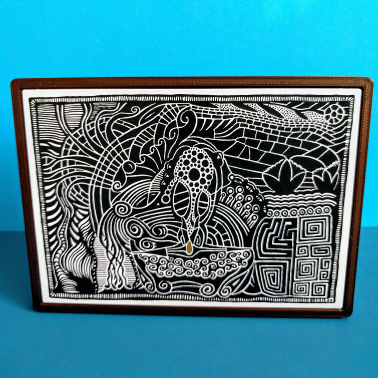

# Boldport Dreamer Frame

This is a 3d printable press-fit frame for [Boldport's Dreamer PCB art](https://www.boldport.com/products/dreamer/).

* Fastener-free: V3

    The stand has been redesigned (it's prettier!) and a badge magnet holder has been added.
    
    The badge magnet is [one of these](https://www.amazon.com/totalElement-Magnetic-Fastener-Adhesive-10-Pack/dp/B00EHK287M) -- if you've got one lying around the measurements are approximately: 31mm center-to-center on the magnets with a 10mm diameter on each magnet; total dimensions are 13.08mm wide, 45.04mm long, 1.03mm thick)

    *Instructions*: Print the frame (`Dreamer-V3 Frame.stl` and either the stand `Dreamer-V3 - Stand.stl` or badge magnet holder `Dreamer-V3 - MagnetMount.stl`.
    
     Both can be tapped into the hole *gently* with a mallet. For the badge magnet, the magnet is slightly loose and can be secured with a bit of double-sided tape.

* Fastener version: V2 and its stand is attached with an M3 (or epoxy/hot glue, artist/assembler's choice).

    * The frame+stand hole takes an M3 screw (CAD: 2.85mm in diameter, with a depth of 6.5mm--stand included). 

    * Preferred screw size: [M3 x 6mm](https://www.trimcraftaviationrc.com/index.php?route=product/product&product_id=244) (or shorter depth). With a 0.4mm nozzle (and associated slicer settings), a small
    slot will be visible that shows how deep the screw is embedded. Don't overtighten/bottom out; an impression of the screw will show on the
    frame's face.
    
For tapping, or printer weirdness, the STEP files are provided. The tap size for an M3 is around 2.50mm.

