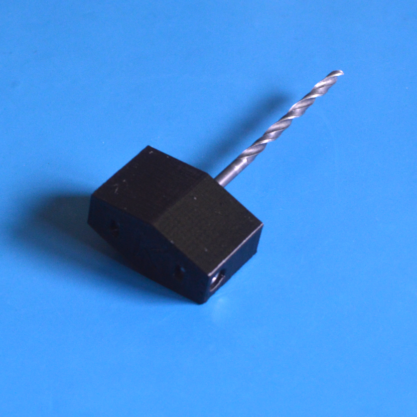

# K-Drill

This is a visually reconstructed copy of [Prusa Research's P-Drill](https://manual.prusa3d.com/Guide/1.+Y-carriage+drilling/323). The P-Drill was a part of the Prusa i3 MK2 to MK2s upgrade,
and was used to enlarge the bed mounting plate for the U-bolts. 

The part was not included in the latest MK2.5S upgrade kit (and I couldn't find it online).

Some similarities/differences between the K-Drill and P-Drill:

* This takes a 1/8" drill bit (3.175 mm)

* Two 12mm socket cap M3 screws are used to secure the bit

* Two M3 hex nuts are inserted in the slots to capture the screws

* This is the K-Drill to distinguish it from the P-Drill
