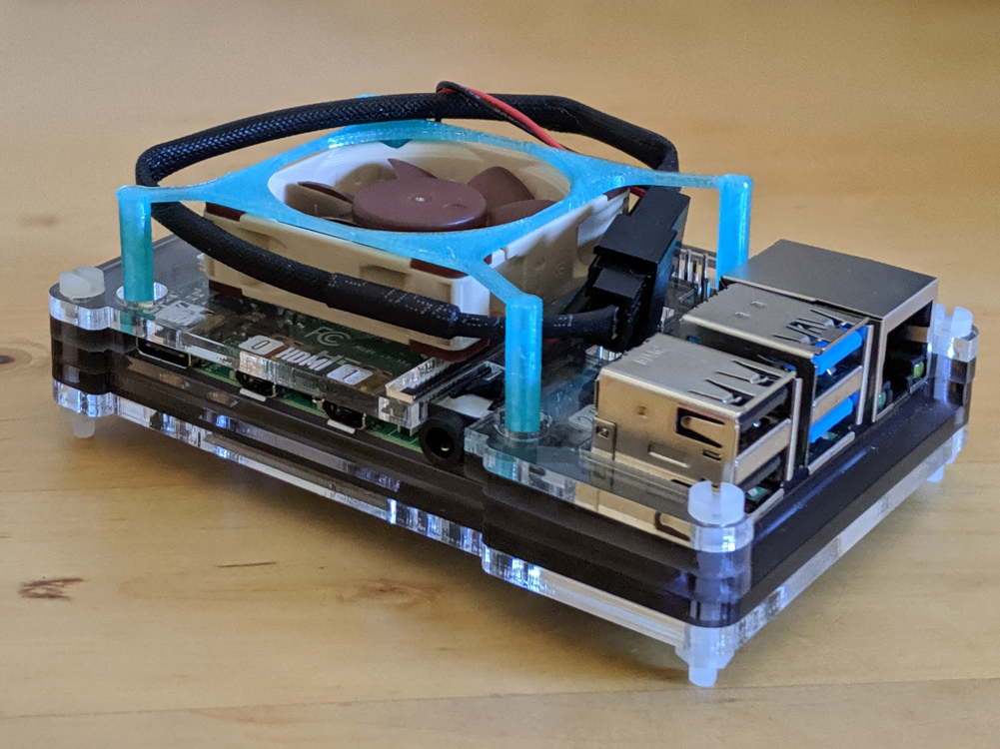

# Raspberry Pi 4 Fan Holder

This is a simple print to hold a fan above the CPU of a Raspberry Pi 4.

The pictured fan is a 40x10mm Noctua NF-A4X10-FLX at 5V. The two pin converter has dupont-style socket headers crimped on (these aren't provided).

If you're interested in something like this, [Pimoroni's Fan SHIM](https://shop.pimoroni.com/products/fan-shim) is a more user-friendly/controllable fan with comparable cooling results.
